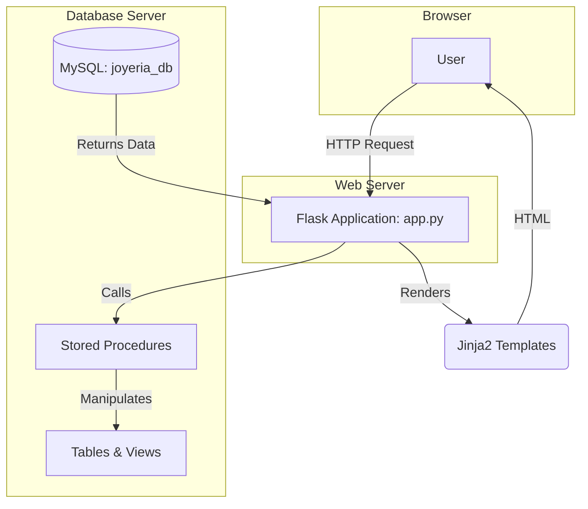

# Project Overview
This repository contains a Flask-based eCommerce and management system for a jewelry business. It features a public-facing product catalog and a role-based backend for administration, sales, inventory management, finance, and auditing. The application's business logic is heavily encapsulated within MySQL stored procedures for database interactions.

## Repository Structure
*   `app.py`: The main Flask application file containing all routes and core backend logic.
*   `config.py`: Contains configuration classes for different environments (dev, prod).
*   `requirements.txt`: Lists the Python dependencies for the project.
*   `run.sh`: A shell script to set environment variables and start the Flask development server.
*   `scripts/`: Holds all SQL scripts for database setup. They are intended to be executed in a specific order.
    *   `create_database.sql`: Creates the `joyeria_db` database and the `joyeria_user` user, granting it the necessary privileges.
    *   `create_tables.sql`: Defines and creates all the database tables, establishing the core schema.
    *   `create_views.sql`: Creates SQL views to simplify complex queries for reporting and data analysis (e.g., `vtopVentasMes`, `vInventarioBajo`).
    *   `create_stored_procedures.sql`: Contains all the business logic encapsulated in stored procedures (e.g., `productoAlta`, `pedidoCrear`, `devolucionCrear`).
    *   `create_triggers.sql`: Sets up database triggers for auditing, data integrity, and automatic actions (e.g., logging changes, validating stock).
    *   `insert_data.sql`: Populates the tables with initial seed data, including roles, categories, sample products, and users.
    *   `create_temporary_tables.sql`: Defines temporary tables used for specific, session-based operations like generating reports.
*   `static/`: Contains static assets such as CSS stylesheets and JavaScript files.
*   `templates/`: Stores all Jinja2 HTML templates used for rendering the web pages.
*   `CONTRIBUTING.md`: Provides guidelines for contributing to the project.
*   `README.md`: The main project README with setup instructions.
*   `.gitignore`: Specifies files and directories to be ignored by Git.

## Build & Development Commands

### Installation
1.  **Create and activate a virtual environment:**
    ```shell
    python3 -m venv .venv
    source .venv/bin/activate
    ```
2.  **Install Python dependencies:**
    ```shell
    pip install -r requirements.txt
    ```

### Database Setup
Execute the following commands to set up the MySQL database. You will be prompted for the `joyeria_user` password.
```shell
# Run as MySQL root user to create the database and user
mysql -u root -p < scripts/create_database.sql

# Run as joyeria_user for the rest of the setup
mysql -u joyeria_user -p joyeria_db < scripts/create_tables.sql
mysql -u joyeria_user -p joyeria_db < scripts/create_views.sql
mysql -u joyeria_user -p joyeria_db < scripts/create_stored_procedures.sql
mysql -u joyeria_user -p joyeria_db < scripts/create_triggers.sql
mysql -u joyeria_user -p joyeria_db < scripts/insert_data.sql
mysql -u joyeria_user -p joyeria_db < scripts/create_temporary_tables.sql
```

### Running the Application
```shell
bash run.sh
```
The application will be available at `http://0.0.0.0:5000`.

### Testing, Linting & Type-Checking
> TODO: No configurations for testing, linting, or type-checking have been found. It is recommended to set up tools like `pytest`, `flake8` (or `ruff`), and `mypy`.

## Code Style & Conventions
*   **Python:** Follows general PEP8 guidelines. The application heavily relies on decorators for authentication and role-checking (`@login_requerido`, `@requiere_rol`). Business logic should be implemented in stored procedures, not in Python code.
*   **Database:** All database interactions from the Flask app must be performed by calling stored procedures. Direct SQL queries are strongly discouraged in the application code.
*   **Commit Messages:** Follow the conventional commit format as described in `CONTRIBUTING.md`.
    *   **Template:** `<type>: <Subject in imperative mood>`
    *   **Example:** `feat: Implement user password reset endpoint`

## Architecture Notes
The system is a monolithic Flask web application connected to a MySQL database. The architecture emphasizes a "smart database" pattern, where most of the business rules, data validation, and logic are executed by stored procedures within MySQL.


*   **User Interface:** The frontend is rendered server-sidetemplates.
*   **Backend Logic:** `app.py` handles HTTP requests, manages user sessions, and acts as a thin layer that calls stored procedures in the database.
*   **Data Layer:** The MySQL database contains the schema, data, and a comprehensive set of stored procedures that encapsulate almost all business logic (e.g., creating orders, registering users, checking inventory).

## Testing Strategy
> TODO: No testing framework is currently configured. A testing strategy should be developed, including:
> 1. **Unit Tests:** Use `pytest` to test individual functions, especially helper utilities and API endpoint logic in `app.py`.
> 2. **Integration Tests:** Write tests that verify the interaction between the Flask application and the database, ensuring that stored procedure calls behave as expected.
> 3. **Database Tests:** Consider a separate suite of tests to validate the logic within the stored procedures themselves.

## Security & Compliance
*   **Secrets Management:** Secrets are managed via `config.py` and can be loaded from environment variables. **Warning:** The repository contains insecure default credentials (e.g., database password). These must be changed and loaded securely in a production environment.
*   **Dependency Scanning:** Use a tool like `pip-audit` to scan `requirements.txt` for known vulnerabilities.
    ```shell
    pip-audit -r requirements.txt
    ```

## Agent Guardrails
Automated agents should adhere to the following boundaries:
*   **Forbidden Files:** Never directly modify or commit `config.py`, `.venv/`, `.git/`, or any files containing secrets or local environment settings.
*   **Database Schema:** Any changes to the database schema (`scripts/*.sql`) require careful review by a human. Do not apply schema changes without approval.
*   **Core Logic:** Modifications to authentication, authorization, and session management logic in `app.py` must be reviewed by a human.
*   **Code Generation:** When adding new features, prioritize creating or modifying stored procedures for business logic over adding complex logic in Python.

## Extensibility Hooks
*   **Environment Variables:** The application configuration in `config.py` can be overridden using environment variables (e.g., `MYSQL_HOST`, `MYSQL_PASSWORD`, `SECRET_KEY`). This is the primary method for configuring the application for different environments.
*   **Feature Flags:**
    > TODO: No feature flag system is currently in place.

## Further Reading
*   [README.md](./README.md): Provides setup and installation instructions.
*   [CONTRIBUTING.md](./CONTRIBUTING.md): Details the contribution workflow and commit standards.
